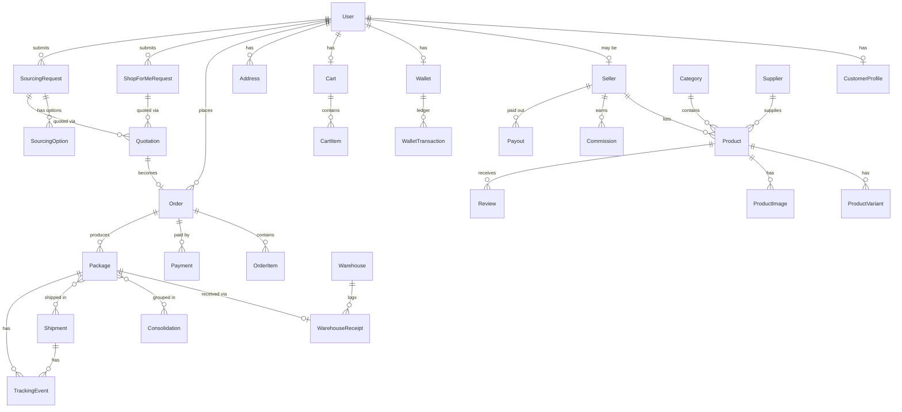

# ATG Mall — Database Schema Reference

Full source of truth: [`prisma/schema.prisma`](./prisma/schema.prisma). This file is the human-readable summary shown before backend implementation, per the project brief.

## Core entity relationships

## Entity summary

| Domain | Models |
|---|---|
| Identity & access | `User`, `Role` (enum), `CustomerProfile`, `Address`, `AuditLog` |
| Catalog | `Category`, `Supplier`, `Seller`, `Product`, `ProductVariant`, `ProductImage`, `Review` |
| Cart & Orders | `Cart`, `CartItem`, `Order`, `OrderItem`, `Payment`, `Coupon` |
| Wallet | `Wallet`, `WalletTransaction` (append-only ledger) |
| Sourcing | `ShopForMeRequest`, `SourcingRequest`, `SourcingOption`, `Quotation`, `QuotationLineItem` |
| Logistics | `Warehouse`, `WarehouseReceipt`, `Package`, `Consolidation`, `ConsolidationPackage`, `Shipment`, `ShipmentPackage`, `TrackingEvent`, `ShippingRate`, `DeliveryZone` |
| Marketplace (Phase 3) | `Commission`, `Payout` |
| Support & notifications | `Notification`, `SupportTicket`, `SupportMessage` |

## Key design decisions

1. **Money as integers.** Every amount is `*Minor` (kobo/butut/cents/fen) plus a sibling `currency` enum column. No float ever represents money.
2. **Ledgered wallet.** `Wallet.balanceMinor` is a cached projection; the only way it changes is inside the same transaction that appends a `WalletTransaction` row recording type, signed amount, and the resulting balance. The wallet is never `UPDATE`d in isolation.
3. **Status enums match the brief verbatim** for `OrderStatus`, `PackageStatus`, and `ShipmentStatus`, so the UI timelines map 1:1 onto the spec without translation tables.
4. **One `Product` table serves every source.** `sourcePlatform` (`ATG | MOCK_1688 | MOCK_TAOBAO | ALIBABA | SELLER`) plus nullable `sourceUrl`/`sourceProductId` mean a live 1688/Taobao integration or seller-marketplace listings drop into the same table later — no migration required to "turn on" Phase 2/3.
5. **Sourcing → Quotation → Order is one funnel.** Both `ShopForMeRequest` and `SourcingRequest` resolve into a `Quotation`; accepting a quotation creates an `Order` (`Order.shopForMeRequestId` / `Order.sourcingRequestId` back-reference), so fulfillment, packages, and tracking are identical regardless of how the order originated.
6. **Packages are the atomic logistics unit.** An `Order` can yield multiple `Package`s (multiple supplier shipments); packages can be grouped into a `Consolidation` before being grouped again onto a `Shipment`. `TrackingEvent` rows (linked to shipment and/or package) are the append-only source of truth for timelines — status fields are the current state, events are the history.
7. **Shipping rates and delivery zones are admin-managed data**, not constants in code — `ShippingRate` is keyed by destination country + method, `DeliveryZone` by country + city, both editable from `/admin/settings` and `/admin/shipping-rates`.
